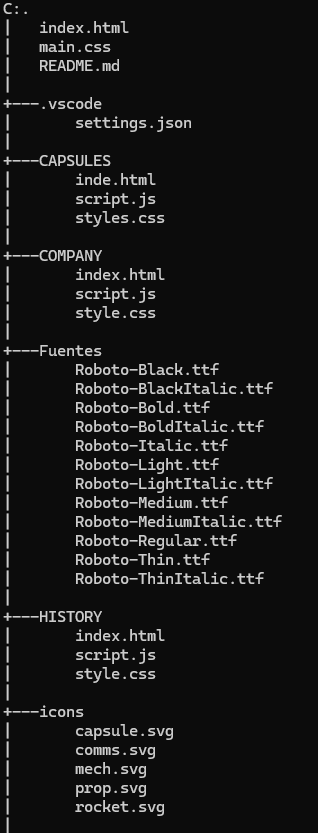
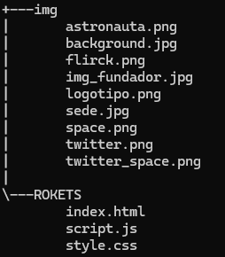

# EL COHETE 

El cohete es un portafolio donde permite visualizar todos los servicios disponibles que tiene la empresa spacex.

## Descripción EL COHETE 

El portafolio contiene cuatro partes fundamentales:

* Company
* Capsule
* Rockets
* History

## Características

Para la elaboracion que cada parte principal creamos carpetas diferentes: 

* `CAPSULES/` Contiene las carpetas 
    - `inde.html`: Donde contiene la escructura de la pagina.
    - `script.js`: Donde contiene los funcionamientos y movimiento que contiene la pagina.
    - `styles.css`: Donde contiene la estilos de la pagina.

* `Fuentes/` Contiene todos los fuentes personalizadas que fueron usadas para la elaboración el porfatolio.

* `COMPANY/` Contiene las carpetas
    - `index.html`: Donde contiene la escructura de la pagina.
    - `script.js`: Donde contiene los funcionamientos y movimiento que contiene la pagina.
    - `styles.css`: Donde contiene la estilos de la pagina.

* `HISTORY/` Contiene las carpetas
    - `index.html`: Donde contiene la escructura de la pagina.
    - `script.js`: Donde contiene los funcionamientos y movimiento que contiene la pagina.
    - `styles.css`: Donde contiene la estilos de la pagina.

* `icons/` Contiene los iconos de la parte inferior del portafolio.

* `img/` Contiene todas las imagenes usadas para la creacion del porfolio.

* `ROCKETS/` Contiene las carpetas
    - `index.html`: Donde contiene la escructura de la pagina.
    - `script.js`: Donde contiene los funcionamientos y movimiento que contiene la pagina.
    - `styles.css`: Donde contiene la estilos de la pagina.

* `index.html/` Contiene la esctructura de la pagina principal del portafolio.

* `main.css/` Contiene los estilos de la pagina principal del portafolio.

## Caractristicas de diseños

- El portafolio es responsive donde contiene Media-queys para hacer posible la adaptación a diferentes dispositivos tecnologicos

## Estructura del proyecto

## Tecnologías utilizadas 

1. JavaScript
2. HTML5
3. CSS

## Instrucciones de uso.

1. Clonar el repositorio o clonarlo 
2. Abrir el archivo index que se encuentra fuera de las carpetas y abrirlo en open live server

## Créditos

Este protalio fue elaborado por Luis Miguel Caicedo Bermon y Zully Fernanda Ortiz Avendaño.

